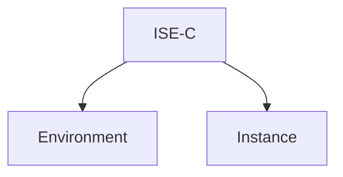
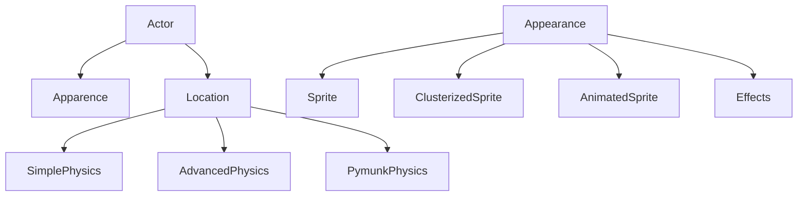
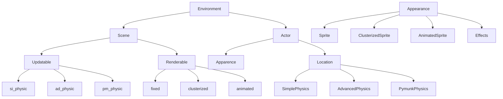

# HELLO WORLD!

# Overview

```mermaid
graph TD
    ISE-C --> Environment;
    ISE-C --> Instance;
```

# Environment
## Actor

```mermaid
graph TD
    Actor --> Apparence;
    Actor --> Location;

    Location --> SimplePhysics
    Location --> AdvancedPhysics
    Location --> PymunkPhysics
        
    Appearance --> Sprite
    Appearance --> ClusterizedSprite
    Appearance --> AnimatedSprite
    Appearance --> Effects
```

###### Save, don't mind

```mermaid
graph TD
    Environment --> Scene;
    Environment --> Actor;
    
    Scene --> Updatable
    Scene --> Renderable
    
    Updatable --> si_physic
    Updatable --> ad_physic
    Updatable --> pm_physic
    
    Renderable --> fixed
    Renderable --> clusterized
    Renderable --> animated
    
    Actor --> Apparence;
    Actor --> Location;

    Location --> SimplePhysics
    Location --> AdvancedPhysics
    Location --> PymunkPhysics
        
    Appearance --> Sprite
    Appearance --> ClusterizedSprite
    Appearance --> AnimatedSprite
    Appearance --> Effects
```
