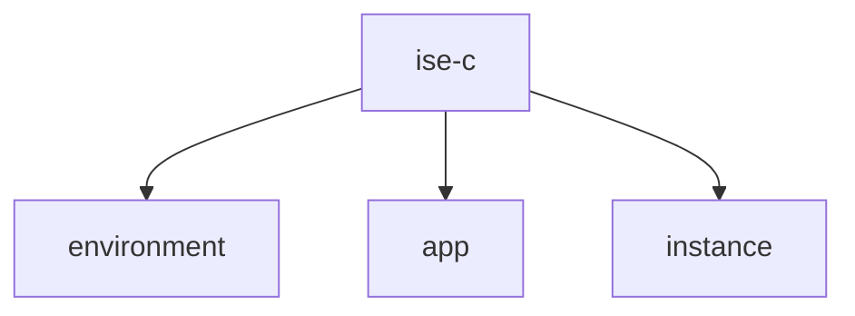
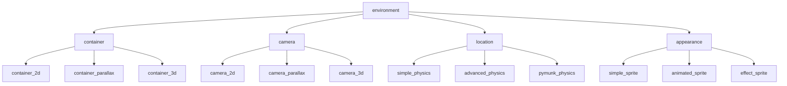
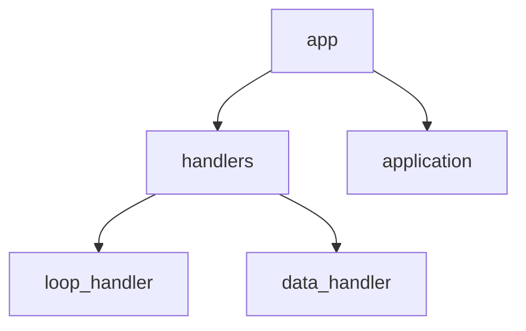
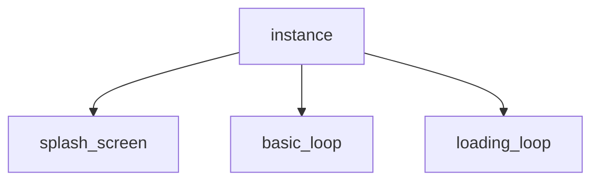

# ICE-C Engine

Salut la team ! 20 petites secondes pour vous mettre bien comme d'habitude 🤙 😎

# Overview

```mermaid
graph TD
    ise-c --> environment
    ise-c --> app
    ise-c --> instance
    
```

## Environment

```mermaid
graph TD
    environment --> container
    container --> container_2d
    container --> container_parallax
    container --> container_3d
    
    environment --> camera
    camera --> camera_2d
    camera --> camera_parallax
    camera --> camera_3d
    
    environment --> location
    location --> simple_physics
    location --> advanced_physics
    location --> pymunk_physics
    
    environment --> appearance
    appearance --> simple_sprite
    appearance --> animated_sprite
    appearance --> effect_sprite
```

## App

```mermaid
graph TD
    app --> handlers
    handlers --> loop_handler
    handlers --> data_handler
    
    app --> application
```

## Instance

```mermaid
graph TD
    instance --> splash_screen
    instance --> basic_loop
    instance --> loading_loop
```
